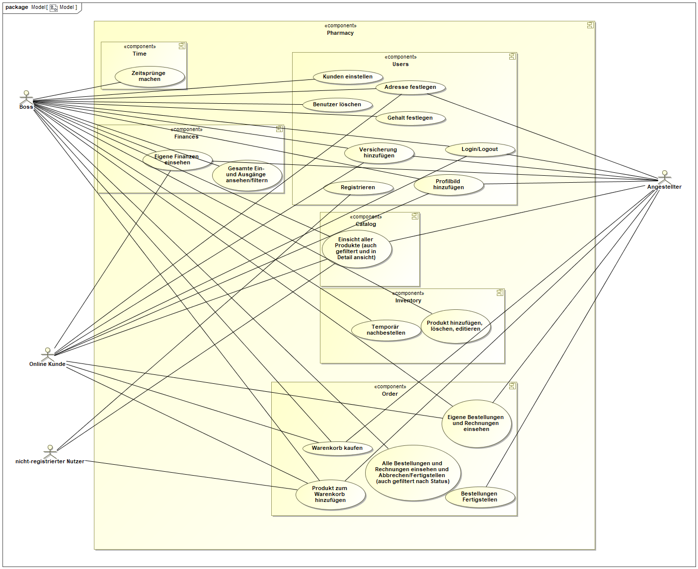
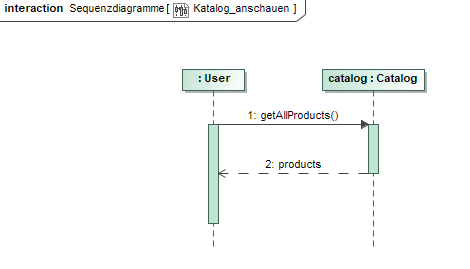
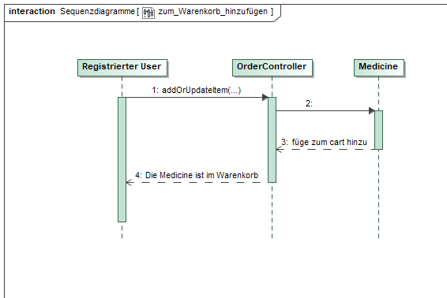
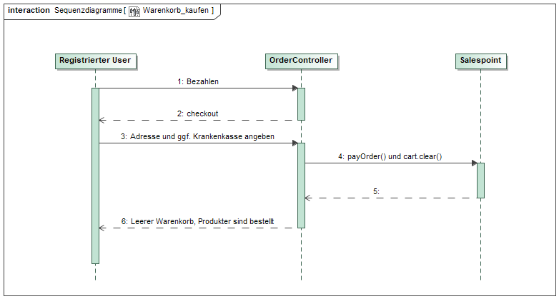
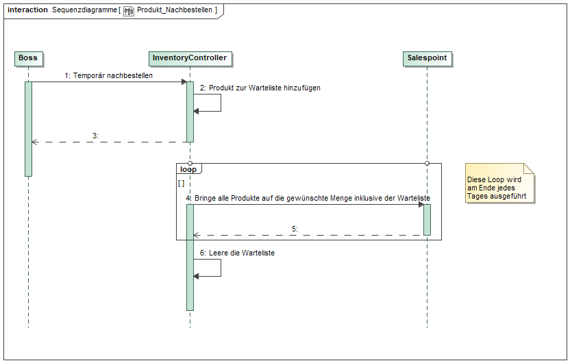
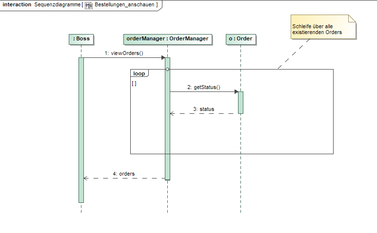

// suppress inspection "LanguageDetectionInspection" for whole file
= Pflichtenheft
:project_name: Projektname
== __{project_name}__

[options="header"]
|===
| Version | Bearbeitungsdatum
| 0.1     | 08.11.2020    
| 0.5     | 15.11.2020    
|===

== Inhaltsverzeichnis
. link:#zusammenfassung[Zusammenfassung] +
. link:#aufgabenstellung-und-zielsetzung[Aufgabenstellung und Zielsetzung] +
. link:#interessensgruppen[Interessensgruppen] +
. link:#systemgrenze-und-top-level-architektur[Systemgrenze und Top-Level-Architektur] +
.. link:#kontextdiagramm[Kontextdiagramm] +
.. link:#top-level-architektur[Top-Level-Architektur] +
. link:#anwendungsfälle[Anwendungsfälle] +
.. link:#akteure[Akteure] +
.. link:#überblick-anwendungsfalldiagramm[Überblick Anwendungsfalldiagramm] +
.. link:#anwendungsfallbeschreibungen[Anwendungsfallbeschreibungen] +
. link:#funktionale-anforderungen[Funktionale Anforderungen] +
. link:#nicht-funktionale-anforderungen[Nicht-Funktionale Anforderungen] +
.. link:#qualitätsziele[Qualitätsziele] +
.. link:#konkrete-nicht-funktionale-anforderungen[Konkrete Nicht-Funktionale Anforderungen] +
. link:#ui-prototyp[UI Prototyp] +
. link:#datenmodell[Datenmodell] +
.. link:#überblick-klassendiagramm[Überblick: Klassendiagramm] +
.. link:#klassen-und-enumerationen[Klassen und Enumerationen] +
. link:#Akzeptanztestfälle[akzeptanztestfälle] +
. link:#Glossar[glossar] +

== Zusammenfassung

include::../asciidoc/pflichtenheft/Zusammenfassung.adoc[]

== Aufgabenstellung und Zielsetzung

include::../asciidoc/pflichtenheft/Aufgabenstellung_und_Zielsetzung.adoc[]

== Produktnutzung

Dieser Bereich gibt einen überblick darüber wie das Programm schlussendlich genutzt werden soll und unter welchen Bedingungen.

Das System soll für eine Apotheke genutzt werden um ihre Produkte zu verkaufen. Die Software soll auf einem Server laufen und ist über das Internet (via Browser) zu erreichen.

Das System soll erreichbar und visuell optimiert sein für folgende Browser:

Mozilla Firefox, Version 55.0.3+

Google Chrome, Version 61.0.3163+

Die Hauptnutzer des Programms sind die Mitarbeiter der Apotheke, welche typische Webseitennavigation beherrschen, wie auch Ärzte und ihre vertrauenswürdigen Schwestern, der Chef, Selbstbedienungskundschaft und registrierte Kunden bei sich daheim.

== Interessensgruppen

include::../asciidoc/pflichtenheft/Interessensgruppen.adoc[]

== Systemgrenze und Top-Level-Architektur

=== Kontextdiagramm

[#img-Kontext]
.Kontext

=== Top-Level-Architektur

include::../asciidoc/pflichtenheft/Top-Level-Architektur.adoc[]

== Anwendungsfälle

=== Akteure

Akteure sind Benutzer des Systems sowie von angrenzenden Systemen die auf unser System zugreifen.
Die folgende Tabelle fasst alle Akteure zusammen und gibt zu jedem eine kurze Beschreibung.

[options="header"]
|===
|Name |Beschreibung
|Boss  | verantwortlich für die Verwaltung des Systems sowie seine Angestellten
|Angestellte | verantwortlich für den Verkauf sowie die Nachbestellung
|Praxis | können Waren direkt aus dem Lager holen
|Registrierte Nutzer | können Waren aus dem Online Shop kaufen
|Nicht-registrierte Nutzer | können sich im Online Shop umschauen, aber nichts zum Warenkorb hinzufügen
|Kunden | können Artikel vor Ort kaufen
|eingeschränkte Kunden | nach einmaliger Registrierung können eingeschränkte Kunden Artikel zur Lieferung bestellen
|===

=== Überblick Anwendungsfalldiagramm

[#img-Anwendungsfalldiagramm]
.Anwendungsfalldiagramm

=== Anwendungsfallbeschreibungen

Hier werden die Anwendungsfälle aus dem Anwendungsfalldiagramm näher beschrieben.
Bei komplexeren Fällen ist auch noch ein Sequenzdiagramm hinterlegt.

[cols="1h, 3"]
[[UC0010]]
|===
|ID                         |**<<UC0010>>**
|Name                       |Login/Logout
|Beschreibung                |Nutzer kann sich einloggen um erweiterte Möglichkeiten im Onlineshop zu bekommen.
Ausloggen macht das rückgängig.
|Akteure                     |registrierte Nutzer
|Auslöser                    |
_Login_: Nutzer will erweiterte Funktionalitäten erlangen.

_Logout_: Nutzer will den Shop verlassen.
|Bedingungen            a|
_Login_: Nutzer ist noch nicht eingeloggt

_Logout_: Nutzer ist registriert
|Notwendige Schritte           a|
_Login_:

1. Nutzer drückt auf "Einloggen"
2. Nutzer gibt seine Daten ein
3. Nutzer drückt auf "Log In" Knopf

_Logout_:

1. Nutzer drückt auf "Ausloggen"
2. Nutzer ist ausgeloggt und wieder auf der Startseite

|Voraussetzungen                 |-
|Funktionale Anforderungen    |<<F01>>
|===

{nbsp} +

[cols="1h, 3"]
[[UC0020]]
|===
|ID                         |**<<UC0020>>**
|Name                       |registrieren
|Beschreibung                |nicht-registrierter Nutzer kann sich einen Account erstellen
|Akteure                     |nicht-registrierte Nutzer
|Auslöser                    |nicht-registrierter Nutzer will sich einen Account erstellen durch Drücken von "Registrieren"
|Bedingungen            a|Akteur ist noch nicht registriert
|Notwendige Schritte           a|

1. nicht-registrierter Nutzer drückt auf "Registrieren"
2. Nutzer gibt seinen erwünschten Nutzernamen und Passwort ein
3. System überprüft ob Nutzername eindeutig ist
. wenn eindeutig: Account mit eingegebenen Daten erstellen
. sonst: eine Fehler-Nachricht wird angezeigt

|Voraussetzungen                 |-
|Funktionale Anforderungen    |<<F02>>, <<F03>>
|===

{nbsp} +

[cols="1h, 3"]
[[UC0030]]
|===
|ID                         |**<<UC0030>>**
|Name                       |Katalog anschauen
|Beschreibung                |Jeder Besucher des Onlineshops soll in der Lage sein den Katalog der Apotheke und damit alle angebotenen Produkte anzuschauen
|Akteure                     |jeder
|Auslöser                    |Besucher will Produkte der Apotheke sehen
|Bedingungen            a|keine
|Notwendige Schritte           a|Nutzer kommt auf die Webseite
|Voraussetzungen                 |-
|Funktionale Anforderungen    |<<F04>>, <<F07>>
|===

[#img-Katalog_anschauen]
.Seqeunzdiagramm: Katalog anschauen

{nbsp} +

[cols="1h, 3"]
[[UC0040]]
|===
|ID                         |**<<UC0040>>**
|Name                       |zum Warenkorb hinzufügen
|Beschreibung                |das gewünschte Produkt in gewünschter Menge zum Warenkorb hinzufügen
|Akteure                     |registrierte Nutzer, Angestellte, Praxis, eingeschränkte Kunden, Kunden
|Auslöser                    |Nutzer will ein Produkt kaufen
|Bedingungen            a|ein registrierter Nutzer sein
|Notwendige Schritte           a|

1. Nutzer ist eingeloggt
2. Nutzer ist auf der Startseite
3. Nutzer wählt das gewünschte Produkt sowie die gewünschte Anzahl aus
4. Nutzer klickt auf zum Warenkorb hinzufügen

|Voraussetzungen                 |-
|Funktionale Anforderungen    |<<F10>>
|===

[#img-zum_Warenkorb_hinzufügen]
.Seqeunzdiagramm: zum Warenkorb hinzufügen

{nbsp} +

[cols="1h, 3"]
[[UC0050]]
|===
|ID                         |**<<UC0050>>**
|Name                       |Warenkorb kaufen
|Beschreibung                |Nutzer kauft die ausgewählten Produkte, woraufhin der Warenkorb geleert wird
|Akteure                     |registrierte Nutzer, Angestellte, Praxis, eingeschränkte Kunden, Kunden
|Auslöser                    |Nutzer will Kaufvorgang abschließen
|Bedingungen            a|ein registrierter Nutzer muss mindestens ein Produkt im Warenkorb haben
|Notwendige Schritte           a|

1. Nutzer fügt beliebig viele Elemente (mindestens 1) zum Warenkorb hinzu
2. Nutzer drückt auf "Kaufen"

|Voraussetzungen                 |-
|Funktionale Anforderungen    |<<F12>>
|===

[#img-Warenkorb_kaufen]
.Seqeunzdiagramm: Warenkorb kaufen

{nbsp} +

[cols="1h, 3"]
[[UC0060]]
|===
|ID                         |**<<UC0060>>**
|Name                       |Kundenliste anschauen/bearbeiten
|Beschreibung                |der Boss sowie die Angestellten können die Kundenliste einsehen und Kunden mit bestimmten Eigenschaften austatten
|Akteure                     |Boss, Angestellte
|Auslöser                    |Kunden sollen mit neuen Attributen ausgestattet werden
|Bedingungen                a|Benutzer ist eingeloggt und hat Rolle "Boss" oder "Angestellter"
|Notwendige Schritte           a|

1. Boss/Angestellte suchen bestimmte Kunden-Accounts
2. Bestimmten Account neue Attribute hinzufügen

|Voraussetzungen                 |-
|Funktionale Anforderungen    |-
|===

{nbsp} +

[cols="1h, 3"]
[[UC0070]]
|===
|ID                         |**<<UC0070>>**
|Name                       |Angestellte verwalten
|Beschreibung                |der Boss kann neue Angestellte hinzufügen, Angestellte feuern und Gehalt anpassen
|Akteure                     |Boss
|Auslöser                    |
_einstellen_: Boss will neue Angestellte einstellen

_feuern_: Boss will einen Angestellten feuern

_Gehalt anpassen_: ein Angestellter kriegt eine Gehaltsanpassung
|Bedingungen            a|Benutzer ist eingeloggt und hat Rolle "Boss"
|Notwendige Schritte           a|
_einstellen_:

1. Boss drückt auf "Angestellten hinzufügen"
2. Boss füllt die Daten des Angestellten aus
3. Boss drückt auf "Hinzufügen"

_feuern_: Boss will einen Angestellten feuern

1. Boss drückt auf "Angestellten entlassen"
2. Boss wählt den Angestellten aus der entlassen wird
3. Boss drückt auf "entlassen"

_Gehalt anpassen_:

1. Boss wählt den gewünschten Angestellten aus
2. Boss füllt die Daten des Angestellten aus
3. Boss drückt auf "aktualisieren"

|Voraussetzungen                 |-
|Funktionale Anforderungen    |<<F15>>
|===

{nbsp} +

[cols="1h, 3"]
[[UC0080]]
|===
|ID                         |**<<UC0080>>**
|Name                       |Account erstellen
|Beschreibung                |der Boss sowie die Angestellten können neue Accounts erstellen
|Akteure                     |Boss, Angestellte
|Auslöser                    |Kunden wollen einen Account bei der Apotheke haben, z.B. um als eingeschränkter Kunden registriert werden zu können
|Bedingungen                a|Kunde darf noch kein Account haben, Benutzer ist eingeloggt und hat Rolle "Boss" oder "Angestellter"
|Notwendige Schritte           a|

1. Boss/Angestellte klicken auf "registrieren"
2. Daten sowie Extra-Attribute des Kunden eingeben
3. Vorgang abschließen durch "registrieren"

|Voraussetzungen                 |-
|Funktionale Anforderungen    |<<F13>>, <<F14>>, <<F15>>
|===

{nbsp} +

[cols="1h, 3"]
[[UC0090]]
|===
|ID                         |**<<UC0090>>**
|Name                       |Vorrat anschauen
|Beschreibung                |der Boss kann den Bestand der Apotheke einsehen
|Akteure                     |Boss
|Auslöser                    |der Boss will einen Überblick über die Vorräte des Shops haben
|Bedingungen                a|Benutzer ist eingeloggt und hat Rolle "Boss"
|Notwendige Schritte           a|Boss klickt auf "Vorrat"
|Voraussetzungen                 |-
|Funktionale Anforderungen    |<<F04>>
|===

{nbsp} +

[cols="1h, 3"]
[[UC0100]]
|===
|ID                         |**<<UC0100>>**
|Name                       |Produkt nachbestellen
|Beschreibung                |der Boss kann nach seinem Belieben Produkte der Apotheke nachbestellen
|Akteure                     |Boss
|Auslöser                    |der Boss will ein bestimmtes Produkt öfter im Inventar haben
|Bedingungen                a|Benutzer ist eingeloggt und hat Rolle "Boss"
|Notwendige Schritte           a|

1. Boss schaut den Vorrat an
2. Boss klickt wählt ein bestimmtes Produkt aus
3. er wählt die Menge aus
4. abschließen durch Klicken auf "Produkt bestellen"

|Voraussetzungen                 |-
|Funktionale Anforderungen    |<<F04>>, <<F05>>
|===

[#img-Produkt_nachbestellen]
.Seqeunzdiagramm: Produkt nachbestellen

{nbsp} +

[cols="1h, 3"]
[[UC0110]]
|===
|ID                         |**<<UC0110>>**
|Name                       |Bestellungen anschauen
|Beschreibung                |der Boss kann alle abgeschlossenen Bestellungen einsehen
|Akteure                     |Boss
|Auslöser                    |der Boss will die Bestellungen überprüfen
|Bedingungen                a|Benutzer ist eingeloggt und hat Rolle "Boss"
|Notwendige Schritte           a|Boss klickt auf "Bestellungen"
|Voraussetzungen                 |-
|Funktionale Anforderungen    |-
|===

[#img-Bestellungen_anschauen]
.Seqeunzdiagramm: Bestellungen anschauen

== Funktionale Anforderungen

In diesem Abschnitt werden die funktionellen Anforderungen des Systems aufgelistet. Die Tabelle enthält:

* Eine eindeutige Kennung der Anforderung (ID), die während des gesamten Projekts zur Referenzierung verwendet werden kann
* die aktuelle Version der Anforderung, da Änderungen an einer Anforderung während des gesamten Projekts erfolgen können
* Eine kurze Bezeichnung der Anforderung
* Die Beschreibung der Anforderung

Anmerkung: Eine funktionale Anforderung definiert eine Funktion des Systems, die zur Erfüllung der Kundenbedürfnisse implementiert werden soll (z.B. wie durch Anwendungsfälle gezeigt). Im Idealfall enthält sie einen Satz von Eingaben für die betreffende Funktionalität, das beabsichtigte Verhalten und das Ergebnis davon.

Anmerkung: Die funktionalen Anforderungen werden verwendet, um darzustellen, was genau implementiert werden muss (aus Sicht des Entwicklers). Da die Anwendungsfälle meist relativ nahe an der Domäne liegen und meist nicht-technisch sind (können sogar von einem nicht-technischen Kunden geschrieben werden), ist es notwendig, die vom Kunden bereitgestellten Informationen zu spezifizieren und zu organisieren.

[options="header", cols="2h, 1, 3, 12"]
|===
|ID
|Version
|Name
|Beschreibung

|[[F01]]<<F01>>
|v0.1
|Authentisieren
a|
Benutzer werden in Gruppen unterteilt, zum Beispiel: Online Kunden, Mitarbeiter, Ärzte von verschieden Praxen. Benutzer werden durch folgende Attribute Authentifiziert: 

*	Benutzername
*	Passwort

|[[F02]]<<F02>>
|v0.1
|Registrierung
a|
Online Kunden können sich jederzeit registrieren mit:

*	E-Mail 
*	Benutzername
*	Adresse
*	Passwort

Jeder Nutzer hat einen eindeutigen Benutzernamen, d.h. Benutzernamen können nicht zweimal vergeben werden.

Mitarbeiter werden vom Chef bzw. Administrator erstellt, gelöscht und editiert. Mit folgenden Attributen:

*	Arbeitszeiten
*	Name
*	Anschrift
*	Gehalt
|[[F03]]<<F03>>
|v0.1
|Registrierung Validieren
a|
Es wird überprüft ob:

*	Die E-Mail den Richtlinien entspricht
*	Der Benutzer ist mit den gegebenen expliziten Daten noch nicht in der Datenbank

|[[F04]]<<F04>>
|v0.1
|Inventur
a|
Alle Arzneimittel werden beim Eingang registriert und in einen Lagerbestand eingetragen.
Wenn eines Verkauft wird, wird dies ebenfalls registriert

|[[F05]]<<F05>>
|v0.1
|Nachbestellung
a|
Das System erkennt, wenn ein Produkt nicht mehr im Lager vorhanden ist und bestellt automatisch nach.

|[[F06]]<<F06>>
|v0.1
|Ablaufdatumsverarbeitung
a|
Wenn ein Medikament ein Monat vor dem Ablaufdatum ist, werden die Mitarbeiter benachrichtigt und aufgefordert diese Zeitnah zu entsorgen.

|[[F07]]<<F07>>
|v0.1
|Katalog
a|
Das System stellt ein Lesezugriff auf die Medikamenten-Datenbank für Online-Kunden zur Verfügung.  Mitarbeiter, Ärzte und der Chef haben entsprechend einen Änderungszugriff.

|[[F08]]<<F08>>
|v0.1
|Kasse
a|
Eine integrierte Kasse Verwaltet Bestellungen, Gehaltsauszahlungen und Verkäufe, Miete und Strom, allgemeine Einnahmen und Ausgaben, sowie Abrechnung mit den jeweiligen Praxen. Desweiteren können Rechnungen und Berichte erstellt und archiviert werden

|[[F09]]<<F09>>
|v0.1
|Produktdetails
a|
Produkte sollten folgende Attribute haben:

*	ID
*	Name
*	Verpackungsgröße
*	Ablaufdatum
*	Bezeichnung
*	Beschreibung
*	Preis
*	Rezeptpflichtig Ja/Nein

|[[F10]]<<F10>>
|v0.1
|Warenkorb
a|
Online registrierte und authentifizierte Nutzer haben die Möglichkeit Produkte in einen Warenkorb zu legen und diese zu bestellen. Ein nicht eingeloggter Benutzer bekommt eine Nachricht sich anzumelden bzw. sich zu registrieren.

|[[F11]]<<F11>>
|v0.1
|Warenkorb einsehen
a|
Im Warenkorb wird die Vollständige Produktbezeichnung, Preis und evtl. Bild angezeigt. Ebenso werden der Gesamtpreis und die Lieferadresse zur manuellen Validierung angezeigt. (nur für angemeldete Benutzer)

|[[F12]]<<F12>>
|v0.1
|Bezahlung
a|
Nachdem man den Warenkorb eingesehen hat wird man zu Bezahlung weitergeleitet.

|[[F13]]<<F13>>
|v0.1
|Administrator Konto
a|
Das Konto wird beim Initialisieren des Systems festgelegt. Die Möglichkeiten sind:

*	Mitarbeiter hinzufügen/entfernen
*	Gehälter festlegen
*	Manuelle Bestellung
*	Einsicht aller registrierten Benutzer
*	Bearbeitung der registrierten Benutzer
*	Übersicht vom Lagerbestand
*	Übersicht aller Bestellungen und Verkäufe

|[[F14]]<<F14>>
|v0.1
|Kunden Konto
a|
Das Konto wird beim Initialisieren des Systems festgelegt. Die Möglichkeiten sind:

*	Manuelle Bestellung
*	Information zu Verfügbarkeit gelisteter Medikamente
*	Übersicht der bestellten Artikel
*   Kunden können Account selbst löschen
*   Haben einen Warenkorb

|[[F15]]<<F15>>
|v0.1
|Mitarbeiter Konto
a|
Das Konto wird beim Initialisieren des Systems festgelegt. Die Möglichkeiten sind:

*	Manuelle Bestellung
*	Information zu Verfügbarkeit aller Medikamente
*	Übersicht der aller Kunden
*   Mitarbeiter können ihren account nicht löschen
*   Können Bargeld entgegen nehmen und das Medikament somit bezahlen
*   Können nicht verfügbare Medikamente reservieren
|===

== Nicht-Funktionale Anforderungen

=== Qualitätsziele

Die folgende Tabelle zeigt die Qualitätsanforderungen welche vollfüllt werden müssen und zu welchem Umfang.
Die erste Spalte listet die Qualitätsanforderungen auf, worauf hin in den folgenden mit einem "x" markiert die höhe der Priorotät ist.
Die gewählte Priorität muss beachtet werden in der Formulierung der Konkrete Nicht-Funktionale Anforderungen.

1 = nicht wichtig ..
5 = sehr wichtig
[options="header", cols="3h, ^1, ^1, ^1, ^1, ^1"]
|===
|Qualitätsanforderung   | 1 | 2 | 3 | 4 | 5
|Wartbarkeit            |   |   |   | x |
|Benutzbarkeit          |   |   | x |   |
|Sicherheit             |   | x |   |   |
|===

=== Konkrete Nicht-Funktionale Anforderungen

:desired-uptime: 99,5%

[options="header", cols="2h, 1, 3, 12"]
|===
|ID
|Version
|Name
|Beschreibung

|[[NF0010]]<<NF0010>>
|v0.1
|Erreichbarkeit - 
Betriebszeit
a|
Das System soll eine Betriebszeit von **{desired-uptime}**  erreichen.

|[[NF0020]]<<NF0020>>
|v0.1
|Sicherheit - Passwordspeicherung
a|
Passwörter von Benutzern sollen nur als "hash-values" gespeichert werden um Diebstahl zu verhindern.

|===

== UI Prototyp

include::../asciidoc/pflichtenheft/UI_Prototyp.adoc[]

== Datenmodell

=== Überblick: Klassendiagramm
UML-Analyseklassendiagramm

image::https://github.com/st-tu-dresden-praktikum/swt20w39/blob/main/src/main/asciidoc/models/design/ÜberblickKlassendiagramm.png[]

=== Klassen und Enumerationen
Dieser Abschnitt stellt eine Vereinigung von Glossar und der Beschreibung von Klassen/Enumerationen dar. Jede Klasse und Enumeration wird in Form eines Glossars textuell beschrieben. Zusätzlich werden eventuellen Konsistenz- und Formatierungsregeln aufgeführt.

include::../asciidoc/pflichtenheft/Klassen_und_Enumerationen.adoc[]

== Akzeptanztestfälle

Die entwickelte Software unterläuft bevor sie geliefert wird einige Tests. Diese dienen dazu die Anwendung ausführlich auf Fehler zu Testen. Die Tests basieren auf den Sequenzdiagrammen, sowie den Anwendungsfällen. In folgender Tabelle sind Abnahmetests aufgelistet, die die Anwendung durchlaufen muss, um den Kunden zufrieden zu stellen und den Vertrag zu erfüllen.

:Pre: Vorbedingung(en)
:Event: Ereignis
:Result: Erwartetes Resultat

[cols="1h, 4"]
|===
|ID            |[[AT01]]<<AT01>>
|Use Case      |<<UC0010>>
|{Pre}        a|Existierender Nutzer im System.
|{Event}      a|Ein nicht authentifizierter Benutzer meldet sich mit seinen anmeldedaten an und clickt auf login.
|{Result}     a|
- Der Benutzer ist nun unter seinem Benutzerkonto angemeldet
- Er wird auf die Startseite weitergeleitet
- Er hat erweiterte möglichkeiten je nach Rolle, z.B. Kunden: 
** haben einen warenkorb
** können bestellen
- Mitarbeiter:
** können Kunden hinzufügen und entfernen
** haben erweiterte einsicht in Inventar und Bestellungen
|===

[cols="1h, 4"]
|===
|ID            |[[AT02]]<<AT02>>
|Use Case      |<<UC0010>>
|{Pre}        a|Ein authentifizierter Benutzer benutzt das System.
|{Event}      a|Der Benutzer clickt auf "abmelden".
|{Result}     a|
- Der Benutzer wird abgemeldet
- Er verliert die Rechte die ihm vorher als eingeloggter Benutzer zur Verfügung standen
|===

[cols="1h, 4"]
|===
|ID            |[[AT03]]<<AT03>>
|Use Case      |<<UC0020>>
|{Pre}        a|Ein nicht authentifizierter Benutzer benutzt das System.
|{Event}      a|Der nicht angemeldete Benutzer clickt auf "Registrieren" in der Navigationszeile und gibt folgende Informationen an:
- Name
- E-Mail
- Adresse
- Passwort
- Bewegungseingeschränkt ja/nein
Anschliesend clickt er auf "Weiter" um die Informationen abzusenden.
|{Result}     a|
- Ein neuer Benutzer mit den gegebenen Daten wird im System erstellt
- Es ist möglich sich mit diesen Daten im System zu authentifizieren
- Der nicht authentifizierte Nutzer wird zur Startseite weitergeleitet wo er sich anmelden kann
|===

[cols="1h, 4"]
|===
|ID            |[[AT04]]<<AT04>>
|Use Case      |<<UC0010>>
|{Pre}        a|Ein nicht authentifizierter Nutzer benutzt das System.
|{Event}      a|Der nicht angemeldete Benutzer clickt auf "Registrieren" in der Navigationszeile und gibt folgende Informationen an:
- Name
- E-Mail (bereits im System registriert)
- Adresse
- Passwort
- Bewegungseingeschränkt ja/nein
Anschliesend clickt er auf "Weiter" um die Informationen abzusenden.
|{Result}     a|Der Benutzer bekommt die Fehlermeldung "Benutzer existiert bereits".
|===

[cols="1h, 4"]
|===
|ID            |[[AT05]]<<AT05>>
|Use Case      |<<UC0040>>
|{Pre}        a|Ein Benutzer der Gruppe "Kunde" benutzt das System.
|{Event}      a|Der Benutzer clickt auf "hinzufügen" im Kontext eines Medikaments.
|{Result}     a|Das Medikament erscheint im Kontext des "Cart" - Widgets und kann durch "pay" bezahlt werden. Wenn der Benutzer jedoch bewegungseingeschränkt ist kann es auch durch "deliver" bestellt werden, eine Bezahlung ist in beiden Fällen notwendig.

|===

[cols="1h, 4"]
|===
|ID            |[[AT06]]<<AT06>>
|Use Case      |<<UC0050>>
|{Pre}        a|Ein Benutzer der Gruppe "Kunde" benutzt das System.
|{Event}      a|Der Benutzer clickt auf "Pay" bzw. "Deliver". Die liste des "Cart" ist leer.
|{Result}     a|Eine Fehlermeldung erscheint, dass kein Medikament im Warenkorb befindlich ist.
|===

[cols="1h, 4"]
|===
|ID            |[[AT07]]<<AT07>>
|Use Case      |<<UC0030>>
|{Pre}        a|Ein Benutzer der Gruppe "Kunde" benutzt das System.
|{Event}      a|Der Benutzer clickt auf eines der Filter-Kriterien.
|{Result}     a|Das System zeigt nur Medikamente an deren Eigenschaften mit dem Filter übereinstimmen.
|===

[cols="1h, 4"]
|===
|ID            |[[AT08]]<<AT08>>
|Use Case      |<<UC0040>>
|{Pre}        a|Ein Benutzer der Gruppe "Mitarbeiter" benutzt das System.
|{Event}      a|Der Benutzer clickt auf "Kasse" und scannt das Medikament ein.
|{Result}     a|Das Medikament erscheint auf der Liste.
|===

[cols="1h, 4"]
|===
|ID            |[[AT09]]<<AT09>>
|Use Case      |<<UC0050>>
|{Pre}        a|Ein Benutzer der Gruppe "Mitarbeiter" benutzt das System.
|{Event}      a|Der Benutzer clickt auf "Kasse" und scannt Medikamente ein. Anschließend clickt er auf "pay".
|{Result}     a|Eine Fehlermeldung erscheint das keine Bezahlmethode ausgewählt wurde.
|===

[cols="1h, 4"]
|===
|ID            |[[AT10]]<<AT10>>
|Use Case      |<<UC0050>>
|{Pre}        a|Ein Benutzer der Gruppe "Mitarbeiter" benutzt das System.
|{Event}      a|Der Benutzer clickt auf "Kasse" und scannt Medikamente ein. Anschließend clickt er auf "pay".
|{Result}     a|Der bezahlte Betrag wird an das Kassenmanagement übergeben. Das Inventar wird dem Verkauf entsprechend verändert. Die Liste im Interface wird geleert.
|===

[cols="1h, 4"]
|===
|ID            |[[AT11]]<<AT11>>
|Use Case      |<<UC0060>>
|{Pre}        a|Der Benutzer "Boss" bzw. Mitarbeiter benutzen das System.
|{Event}      a|Der Benutzer clickt auf "User".
|{Result}     a|Das System listet alle registrierten Kunden auf, nach Gruppen geordnet.
|===

[cols="1h, 4"]
|===
|ID            |[[AT12]]<<AT12>>
|Use Case      |<<UC0110>>
|{Pre}        a|Der Benutzer "Boss" benutzt das System.
|{Event}      a|Der Benutzer clickt auf "Bestellungen".
|{Result}     a|Das System erstellt eine Finanzübersicht in der alle Transaktionen von der Kasse dargestellt werden.
|===

[cols="1h, 4"]
|===
|ID            |[[AT13]]<<AT13>>
|Use Case      |<<UC0100>>
|{Pre}        a|Der Benutzer "Boss" benutzt das System.
|{Event}      a|Der Benutzer clickt auf "Nachbestellen".
|{Result}     a|Das System bietet die möglichkeit Medikamente über die Lagerkapazität hinaus nachzubestellen.
|===

[cols="1h, 4"]
|===
|ID            |[[AT14]]<<AT14>>
|Use Case      |<<UC0090>>
|{Pre}        a|Der Benutzer "Boss" benutzt das System.
|{Event}      a|Der Benutzer clickt auf "Vorrat".
|{Result}     a|Das System erstellt eine vereinfachte Übersicht die Anzahl aller vorhandenen und nicht vorhandenen Medikamente.
|===

[cols="1h, 4"]
|===
|ID            |[[AT15]]<<AT15>>
|Use Case      |<<UC0080>>
|{Pre}        a|Der Benutzer "Boss" bzw. Mitarbeiter benutzen das System.
|{Event}      a|Der Benutzer clickt auf "User".
|{Result}     a|Das System bietet die Möglichkeit neue Kunden zu registrieren.
|===

[cols="1h, 4"]
|===
|ID            |[[AT16]]<<AT16>>
|Use Case      |<<UC0070>>
|{Pre}        a|Der Benutzer "Boss" benutzt das System.
|{Event}      a|Der Benutzer clickt auf "Mitarbeiter".
|{Result}     a|Das System bietet die möglichkeit Mitarbeiter zu feuern und einzustellen.
|===
== Glossar

include::../asciidoc/pflichtenheft/Glossar.adoc[]
