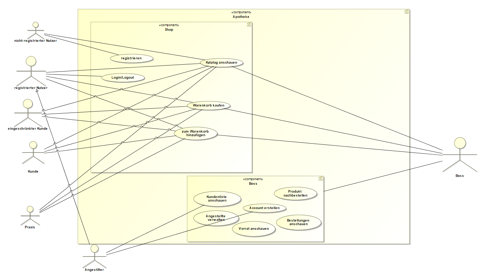

:figure-caption!:
== Anwendungsfälle

=== Akteure
[options="header"]
|===
|Name |Beschreibung
|Boss  | verantwortlich für die Verwaltung des Systems sowie seine Angestellten
|Angestellte | verantwortlich für den Verkauf sowie die Nachbestellung
|Praxis | können Waren direkt aus dem Lager holen
|Registrierte Nutzer | können Waren aus dem Online Shop kaufen
|Nicht-registrierte Nutzer | können sich im Online Shop umschauen, aber nichts zum Warenkorb hinzufügen
|Kunden | können Artikel vor Ort kaufen
|eingeschränkte Kunden | nach einmaliger Registrierung können eingeschränkte Kunden Artikel zur Lieferung bestellen
|===

=== Überblick Anwendungsfalldiagramm

[#img-Anwendungsfalldiagramm]
.Anwendungsfalldiagramm

=== Anwendungsfallbeschreibungen

[cols="1h, 3"]
[[UC0010]]
|===
|Name                       |Login/Logout
|Beschreibung                |Nutzer kann sich einloggen um erweiterte Möglichkeiten im Onlineshop zu bekommen.
Ausloggen macht das rückgängig.
|Akteure                     |registrierte Nutzer
|Auslöser                    |
_Login_: Nutzer will erweiterte Funktionalitäten erlangen.

_Logout_: Nutzer will den Shop verlassen.
|Bedingungen            a|
_Login_: Nutzer ist noch nicht eingeloggt

_Logout_: Nutzer ist registriert
|Notwendige Schritte           a|
_Login_:

  1. Nutzer drückt auf "Einloggen"
  2. Nutzer gibt seine Daten ein
  3. Nutzer drückt auf "Log In" Knopf

_Logout_:

  1. Nutzer drückt auf "Ausloggen"
  2. Nutzer ist ausgeloggt und wieder auf der Startseite

|===

[cols="1h, 3"]
[[UC0010]]
|===
|Name                       |registrieren
|Beschreibung                |nicht-registrierter Nutzer kann sich einen Account erstellen
|Akteure                     |nicht-registrierte Nutzer
|Auslöser                    |nicht-registrierter Nutzer will sich einen Account erstellen durch Drücken von "Registrieren"
|Bedingungen            a|Akteur ist noch nicht registriert
|Notwendige Schritte           a|

  1. nicht-registrierter Nutzer drückt auf "Registrieren"
  2. Nutzer gibt seinen erwünschten Nutzernamen und Passwort ein
  3. System überprüft ob Nutzername eindeutig ist
    . wenn eindeutig: Account mit eingegebenen Daten erstellen
    . sonst: eine Fehler-Nachricht wird angezeigt

|===

[cols="1h, 3"]
[[UC0010]]
|===
|Name                       |Katalog anschauen
|Beschreibung                |Jeder Besucher des Onlineshops soll in der Lage sein den Katalog der Apotheke und damit alle angebotenen Produkte anzuschauen
|Akteure                     |jeder
|Auslöser                    |Besucher will Produkte der Apotheke sehen
|Bedingungen            a|keine
|Notwendige Schritte           a|Nutzer kommt auf die Webseite
|===

[cols="1h, 3"]
[[UC0010]]
|===
|Name                       |zum Warenkorb hinzufügen
|Beschreibung                |das gewünschte Produkt in gewünschter Menge zum Warenkorb hinzufügen
|Akteure                     |registrierte Nutzer, Angestellte, Praxis, eingeschränkte Kunden, Kunden
|Auslöser                    |Nutzer will ein Produkt kaufen
|Bedingungen            a|ein registrierter Nutzer sein
|Notwendige Schritte           a|

  1. Nutzer ist eingeloggt
  2. Nutzer ist auf der Startseite
  3. Nutzer wählt das gewünschte Produkt sowie die gewünschte Anzahl aus
  4. Nutzer klickt auf zum Warenkorb hinzufügen

|===

[cols="1h, 3"]
[[UC0010]]
|===
|Name                       |Warenkorb kaufen
|Beschreibung                |Nutzer kauft die ausgewählten Produkte, woraufhin der Warenkorb geleert wird
|Akteure                     |registrierte Nutzer, Angestellte, Praxis, eingeschränkte Kunden, Kunden
|Auslöser                    |Nutzer will Kaufvorgang abschließen
|Bedingungen            a|ein registrierter Nutzer muss mindestens ein Produkt im Warenkorb haben
|Notwendige Schritte           a|

  1. Nutzer fügt beliebig viele Elemente (mindestens 1) zum Warenkorb hinzu
  2. Nutzer drückt auf "Kaufen"

|===

[cols="1h, 3"]
[[UC0010]]
|===
|Name                       |Kundenliste anschauen/bearbeiten
|Beschreibung                |der Boss sowie die Angestellten können die Kundenliste einsehen und Kunden mit bestimmten Eigenschaften austatten
|Akteure                     |Boss, Angestellte
|Auslöser                    |Kunden sollen mit neuen Attributen ausgestattet werden
|Bedingungen                a|Benutzer ist eingeloggt und hat Rolle "Boss" oder "Angestellter"
|Notwendige Schritte           a|

  1. Boss/Angestellte suchen bestimmte Kunden-Accounts
  2. Bestimmten Account neue Attribute hinzufügen

|===

[cols="1h, 3"]
[[UC0010]]
|===
|Name                       |Angestellte verwalten
|Beschreibung                |der Boss kann neue Angestellte hinzufügen, Angestellte feuern und Gehalt anpassen
|Akteure                     |Boss
|Auslöser                    |
_einstellen_: Boss will neue Angestellte einstellen

_feuern_: Boss will einen Angestellten feuern

_Gehalt anpassen_: ein Angestellter kriegt eine Gehaltsanpassung
|Bedingungen            a|Benutzer ist eingeloggt und hat Rolle "Boss"
|Notwendige Schritte           a|
_einstellen_:  

  1. Boss drückt auf "Angestellten hinzufügen"
  2. Boss füllt die Daten des Angestellten aus
  3. Boss drückt auf "Hinzufügen"

_feuern_: Boss will einen Angestellten feuern

  1. Boss drückt auf "Angestellten entlassen"
  2. Boss wählt den Angestellten aus der entlassen wird
  3. Boss drückt auf "entlassen"

_Gehalt anpassen_:

  1. Boss wählt den gewünschten Angestellten aus
  2. Boss füllt die Daten des Angestellten aus
  3. Boss drückt auf "aktualisieren"
|===

[cols="1h, 3"]
[[UC0010]]
|===
|Name                       |Account erstellen
|Beschreibung                |der Boss sowie die Angestellten können neue Accounts erstellen
|Akteure                     |Boss, Angestellte
|Auslöser                    |Kunden wollen einen Account bei der Apotheke haben, z.B. um als eingeschränkter Kunden registriert werden zu können
|Bedingungen                a|Kunde darf noch kein Account haben, Benutzer ist eingeloggt und hat Rolle "Boss" oder "Angestellter"
|Notwendige Schritte           a|

  1. Boss/Angestellte klicken auf "registrieren"
  2. Daten sowie Extra-Attribute des Kunden eingeben
  3. Vorgang abschließen durch "registrieren"

|===

[cols="1h, 3"]
[[UC0010]]
|===
|Name                       |Vorrat anschauen
|Beschreibung                |der Boss kann den Bestand der Apotheke einsehen
|Akteure                     |Boss
|Auslöser                    |der Boss will einen Überblick über die Vorräte des Shops haben
|Bedingungen                a|Benutzer ist eingeloggt und hat Rolle "Boss"
|Notwendige Schritte           a|Boss klickt auf "Vorrat"
|===

[cols="1h, 3"]
[[UC0010]]
|===
|Name                       |Produkt nachbestellen
|Beschreibung                |der Boss kann nach seinem Belieben Produkte der Apotheke nachbestellen
|Akteure                     |Boss
|Auslöser                    |der Boss will ein bestimmtes Produkt öfter im Inventar haben
|Bedingungen                a|Benutzer ist eingeloggt und hat Rolle "Boss"
|Notwendige Schritte           a|

  1. Boss schaut den Vorrat an
  2. Boss klickt wählt ein bestimmtes Produkt aus
  3. er wählt die Menge aus
  4. abschließen durch Klicken auf "Produkt bestellen"

|===

[cols="1h, 3"]
[[UC0010]]
|===
|Name                       |Bestellungen anschauen
|Beschreibung                |der Boss kann alle abgeschlossenen Bestellungen einsehen
|Akteure                     |Boss
|Auslöser                    |der Boss will die Bestellungen überprüfen
|Bedingungen                a|Benutzer ist eingeloggt und hat Rolle "Boss"
|Notwendige Schritte           a|Boss klickt auf "Bestellungen"
|===
